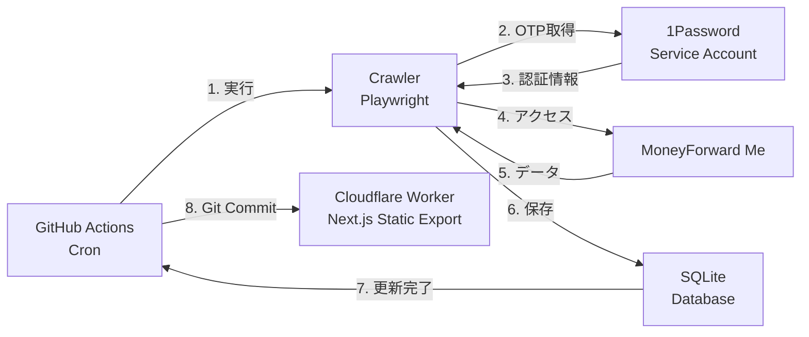

<div align="center">
  
  <h1>MoneyForward Me Dashboard</h1>
  <p>MoneyForward Meを自動化、可視化</p>
</div>

## 機能

### 指定した時間に金融機関の一括更新

GitHubのworkflowでcrontabを使い定期的に実行し、登録金融機関の「一括更新」ボタンを押し監視を行う。デフォルトの設定は、毎日6:50(JST)と15:20(JST)。GitHubのcrontabは指定時間ちょうどに実行されないので、-10分に設定。

### Slackへ結果を投稿

Slack botの設定をすることにより、前日との差分を投稿可能。


### 自分の行いたい処理を実行

hookが提供されているので、スクレイピング時に用意したスクリプトを実行可能。例えば、特定の金融機関の取引の場合に大項目、中項目を常に食品に設定する等。Playwrightの`Page`を持っているので基本何でもできる。

### MCP経由でAIアシスタントと連携

MCP (Model Context Protocol) サーバーを内蔵。ChatGPTやClaude Desktopから、家計・資産・投資データを自然言語で照会できる。詳細は [apps/mcp/README.md](apps/mcp/README.md) を参照。

### すべての情報を可視化

[demoページ](https://hiroppy.github.io/mf-dashboard)を参考。予算機能以外はすべて対応済み。


### 複利シミュレーター

いくら積み立てて、いくら切り崩しをすればいいのかモンテカルロ法を用いて計算。年金なども設定でき、精度高く検証する。

[個別サイト](https://asset-melt.party/)

## 導入方法

[使い方ページ](/docs/setup.md)を参照

## アーキテクチャ

このプロダクトは、GitHub Actionsで定期的にMoneyForward Meのデータを取得してSQLiteに保存し、Cloudflare Pagesで静的サイトをビルド・公開する。Publicで公開する前提のものではないので、以下の構成とする。



**処理の流れ:**

- **定期実行**: GitHub Actionsのcronスケジュールで自動実行
- **認証**: 1Password Service AccountからOTPを取得
- **データ取得**: Playwrightを使用してMoneyForward Meからデータをスクレイピング
- **データ保存**: SQLiteデータベースに構造化して保存
- **コミット**: SQLiteファイルをリポジトリにコミットすることにより、cloudflareをキック
- **ビルド・デプロイ**: Cloudflare PagesでNext.jsの静的サイトをビルドして公開(Cloudflare Oneの利用を強く推奨)

## 推奨セキュリティ

- GitHub
  - Passkey
- MoneyForward Me
  - ワンタイムパスワード
  - Passkeyだけだとクローリングするときにログインできない点に注意
- Cloudflare
  - Cloudflare oneでサイトへのアクセス制限 (e.g. googleログイン)

このプロダクトはスケールさせる必要がないことから、当初GitHubだけで完結するように設計されていた。しかし、Private repoの場合はGitHub Pagesが有料限定ということでページの公開と認証はCloudflareを利用するようにした経緯がある。

SQLiteを今後、pushしなくても良いオプションを作る可能性はあるが、毎回1年分のデータ取得と取得毎のdiffが取れなくなるデメリットがあるため現段階では実装していない。またインフラは今後変える可能性あり。

## 開発

[UIコンポーネント集](https://hiroppy.github.io/mf-dashboard/storybook/)

```sh
$ git clone xxx
$ cd mf-dashboard
$ cp .env.sample .env  # demoで確認したいだけであれば不要
$ pnpm i
# demoデータで確認
$ pnpm dev:demo
# 実際のアカウントのデータを取得する場合
$ pnpm db:dev
$ pnpm dev
```

## 更新

```sh
$ sh update.sh
```
